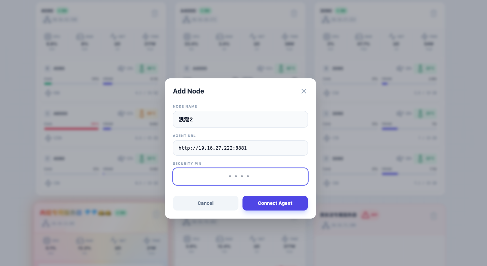

# 浪潮云服务器离线部署与跨服务器调用教程

## 第一步：部署Python环境
由于浪潮服务器无法上网且无法升级系统 Python（系统py为3.6，太低了），我们使用预编译的独立版 Python。

在中转机器下载（我在Mac上下载的，SFTP上浪潮） Python 3.10 压缩包：[下载链接](https://github.com/astral-sh/python-build-standalone/releases/download/20260114/cpython-3.10.19+20260114-x86_64-unknown-linux-gnu-install_only.tar.gz)

然后在一个能上网的linux机器上下载适配 Python 3.10 的离线依赖包：
``` bash

mkdir -p ~/offline_packages

cd ~/offline_packages

pip download \
    --only-binary=:all: \
    --platform manylinux2014_x86_64 \
    --python-version 3.10 \
    --implementation cp \
    --abi cp310 \
    -d ./offline_packages \
    fastapi uvicorn pydantic pydantic-core psutil exceptiongroup nvidia-ml-py
```

## 第二步：把这些资源通过SFTP上传到浪潮服务器

``` bash
scp -P 30199 cpython-3.10.13...tar.gz root@172.20.5.56:/root/project/
scp -P 30199 -r ~/offline_packages root@172.20.5.56:/root/project/
```

## 第三步：在浪潮服务器上安装Python环境

**1. 解压Python压缩包**
``` bash
cd /root/project/
tar -xzf cpython-3.10.13...tar.gz
```

**2. 创建并激活虚拟环境**
``` bash
./python/bin/python3 -m venv venv_new
source venv_new/bin/activate
# 验证版本：python -V 应该显示 3.10.x
```

**3. 安装离线依赖包**
``` bash
pip install --no-index --find-links=./offline_packages/ fastapi uvicorn pydantic psutil nvidia-ml-py
```

**4. 测试运行**
``` bash
# 测试运行FastAPI应用
python main.py
# 不报错，而且GPU能获取
```

**5. 永久运行** 
``` bash
# 启动命令
nohup python main.py > output.log 2>&1 &

# > output.log: 把所有的程序输出（打印的信息）存到这个文件里。

# 2>&1: 把报错信息也存到同一个文件里。

# 最后那个 &: 代表在后台运行。

# 如何停止？
# 找到该进程的 ID (PID)
ps -ef | grep python
# 然后杀掉它
kill -9 <PID数字>

```

**以上操作完成后就可以关掉这个浪潮服务器了**

## 第四步：在其他服务器调用这个浪潮服务器的API
在另一个本地服务器上进行ssh穿透：


``` bash
# 浪潮1:
ssh -fN -L 0.0.0.0:8880:localhost:8005 root@172.20.5.56 -p 30199

# 浪潮2:
ssh -fN -L 0.0.0.0:8881:localhost:8005 root@172.20.5.56 -p 30746
```


通过调用http://10.16.27.222:8880/metrics即可获取浪潮1的指标
通过调用http://10.16.27.222:8881/metrics即可获取浪潮2的指标
（当然这个里的10.16.27.222是我本地服务器的IP，你需要根据自己的情况修改）

添加到看板即可


